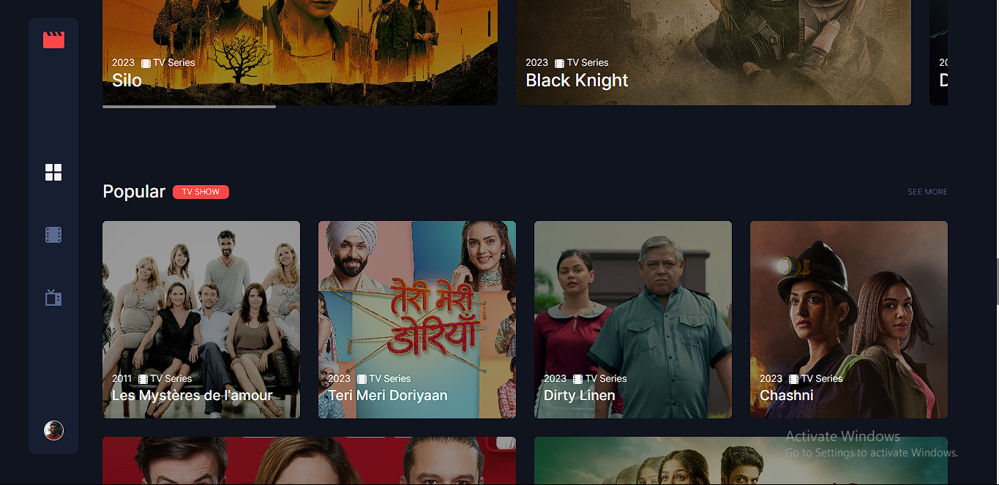
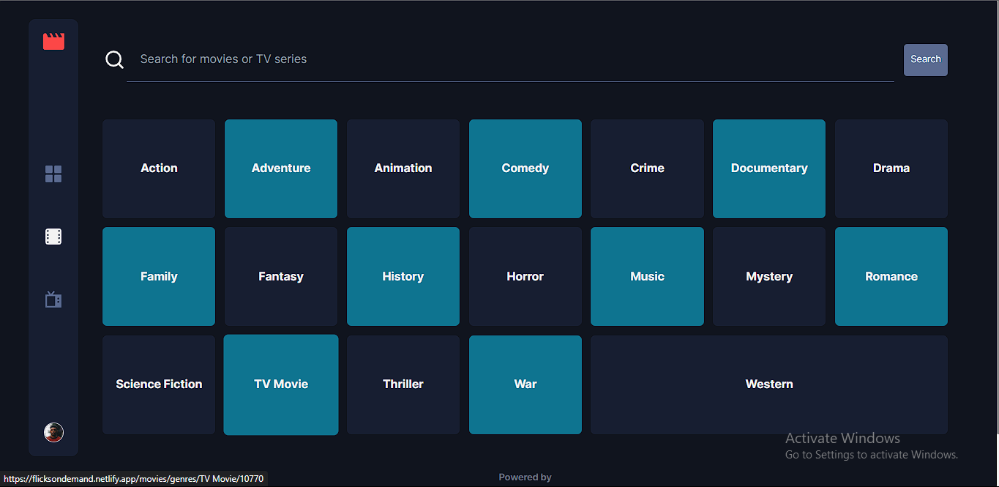

# Table Of Contents

- [Table Of Contents](#table-of-contents)
  - [Getting Started](#getting-started)
- [ Entertainment Web Application](#entertainment-web-application)
  - [Screenshots](#screenshots)
  - [Tools](#tools)
    - [React libraries/hooks/frameworks used](#react-librarieshooksframeworks-used)
  - [What I learnt building this](#what-i-learnt-building-this)
  - [Contributing](#contributing)
  - [Acknowledgements](#acknowledgements)
  - [Contact](#contact)

## Getting Started

1. Clone this repository to your local machine using the following command:
   `git clone <repository-url>`
   "working"

2. Navigate to the project's directory
   `cd movie-entertainment-web-app`

3. Install the dependencies using your preferred package manager
   `npm install`

4. Obtain an API key from [The Movie Database (TMDb)](themoviedb.org) by creating an account and generating an API key.

5. Create a .env file in the root directory of the project and add the following line, replacing <your-api-key> with your actual TMDb API key:
   `REACT_APP_TMDB_API_KEY=<your-api-key>`

6. Start development server
   `npm start`

This will run the application in development mode. Open http://localhost:3000 in your browser to view it.

# Movie Entertainment Web Application

I'm thrilled to share my latest project, a  entertainment web application that has been an incredible journey for me as an aspiring frontend developer. With a strong focus on sharpening my skills, I embarked on this endeavor to showcase my newly acquired expertise in React.

This web application serves as a haven for movie enthusiasts, allowing them to delve into a vast collection of movies and TV shows. Through seamless integration with APIs, users can easily search for their favorite movies and TV shows, and access detailed information about each title. I dedicated significant effort to ensure a smooth and intuitive search experience, enabling users to find their desired content with just a few clicks. Whether searching by title or exploring genres, users can tailor their experience to suit their preferences.

Immersing myself in the development process, I crafted a visually appealing and user-friendly interface using CSS styling techniques. Each movie and TV show is presented with captivating details such as descriptions, cast information, release dates, and ratings. By providing users with comprehensive insights, I aimed to empower them to make informed choices and discover new favorites.

## Screenshots

## Tools

- HTML5
- SCSS
- GRID
- Mobile-first workflow
- [React](https://reactjs.org/) - JS library
- [TailwindCSS](https://tailwindcss.com/docs/installation) - CSS Framework
- [Vite](https://vitejs.dev/)
- [The Movie Database API](https://developers.themoviedb.org/3/getting-started/introduction)

### React libraries/hooks/frameworks used

- useState
- useEffect
- useMediaQuery
- useParams
- useNavigate
- React Router Dom
- React Spinners `BeatLoader` precisely

## What I learnt building this

This is by far the most complex project I've ever built. This is an inpired project by one of frontendmentors project, but this is not the solution to the challenge at frontendmentors. I couldn't have imagined how i'm supposed to build this using just javascript. For the first time, i worked on a project i think couldn't have been built using javascript only!. There might have been a way using javascript as well, but none that I know of currently and i'm going to conduct my research on this.

## Contributing

Contributions are welcome! If you'd like to contribute to this  entertainment web application, please follow these steps:

1. Fork the repository and create your branch
   `git checkout -b my-branch`

2. Make your changes and commit them
   `git commit -m "My changes"`

3. Push to your branch
   `git push origin my-branch`

4. Open a pull request in this repository, and provide a detailed description of your changes and improvements.

## Acknowledgements

I would like to express my gratitude to the following resources that helped me throughout the development of this project:

1. [React Documentation](https://react.dev/)
2. [TailwindCSS documentation](https://tailwindcss.com/docs/installation)
3. [The Movie Database (TMDb) API documentation](ttps://developers.themoviedb.org/3/getting-started/introduction)

## Contact

If you have any questions or feedback, feel free to reach out to me:

- Email: shahzada0907@gmail.com

